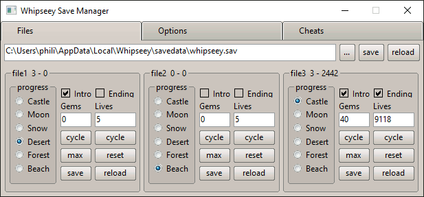

# Whipseey Save Manager

# REWRITE IN PROGRESS

**GUI for modifying *some* Values in 'Whipseey and the Lost Atlas' Savegames and Settings**

Intended to aid with Speedrun practice. Can modify *most* values present in the Savegame.

The Game needs to be restarted to load a modified Savegame or Settings. Autosaving ingame will override all Slots in the
Savegame.

## Features

### planned

- Set Save-Slot values
    - Level-Progress, Lives, etc
- Change Options
    - Language, Volume, etc
- Enable Cheats

## Warnings

## Code

- see other branches for older versions in other languages

### Dependencies

- [iced](https://github.com/iced-rs/iced) [MIT]
- [iced_aw](https://github.com/iced-rs/iced_aw) [MIT]
- [steamlocate](https://github.com/WilliamVenner/steamlocate-rs) [MIT]
- [rust-ini](https://github.com/zonyitoo/rust-ini) [MIT]
- [opener](https://github.com/Seeker14491/opener) [MIT]
- [rfd](https://github.com/PolyMeilex/rfd) [MIT]
- [num_enum](https://github.com/illicitonion/num_enum) [MIT]
- [thiserror](https://github.com/dtolnay/thiserror) [MIT]
- [tokio](https://github.com/tokio-rs/tokio) [MIT]
- [strum](https://github.com/Peternator7/strum) [MIT]
- [num](https://github.com/rust-num/num) [MIT]

### Tests

some tests are ignored by default and need to be run explicitly. see tags below
