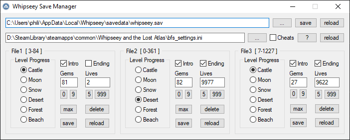

# Whipseey Save Manager

-------------------------

**! WIP !**

-------------------------

**GUI for modifying *some* Values in 'Whipseey and the Lost Atlas' Savegames and Settings**

<!--  -->

Intended to aid with Speedrun practice. Does not allow to modify all values present in the Savegame.

Game needs to be restarted to load a modified Savegame or Settings. Autosaving ingame will override all Slots in Savegame.

## Features

- ???

## Warnings

- Windows only
- only tested on Windows 10 (2004) x64

## Code

written in/with C++ 17

uses cmake

### Dependencies

- Testing : [Catch2](https://github.com/catchorg/Catch2)
- Registry : [WinReg](https://github.com/GiovanniDicanio/WinReg)
- INI : [simpleini](https://github.com/brofield/simpleini)
- GUI : [nana](https://github.com/cnjinhao/nana)

### Tests

some tests are hidden and need to be run explicitly. see tags below

- [Manual] some of there returns need to be checked by hand
- [Game] output varies depending on if the game is installed (with steam)
- [Save] output varies depending on if a savegame is available in the default location
