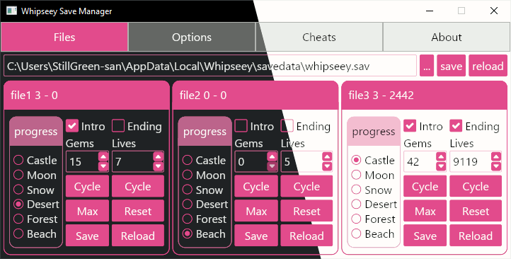

# Whipseey Save Manager

# REWRITE IN PROGRESS

**GUI for modifying *some* Values in 'Whipseey and the Lost Atlas' Savegames and Settings**

Intended to aid with Speedrun practice. Can modify *most* values present in the Savegame.

The Game needs to be restarted to load a modified Savegame or Settings. Autosaving ingame will override all Slots in the
Savegame.

## Features

### planned

- Set Save-Slot values
    - Level-Progress, Lives, etc
- Change Options
    - Language, Volume, etc
- Enable Cheats

## Warnings

## Code

- see other branches for older versions in other languages

### Dependencies

- GUI : [iced](https://crates.io/crates/iced)
- GUI : [iced_aw](https://crates.io/crates/iced_aw)
- INI : [rust-ini](https://crates.io/crates/rust-ini)
- Steam : [steamlocate](https://crates.io/crates/steamlocate)

### Tests

some tests are ignored by default and need to be run explicitly. see tags below
